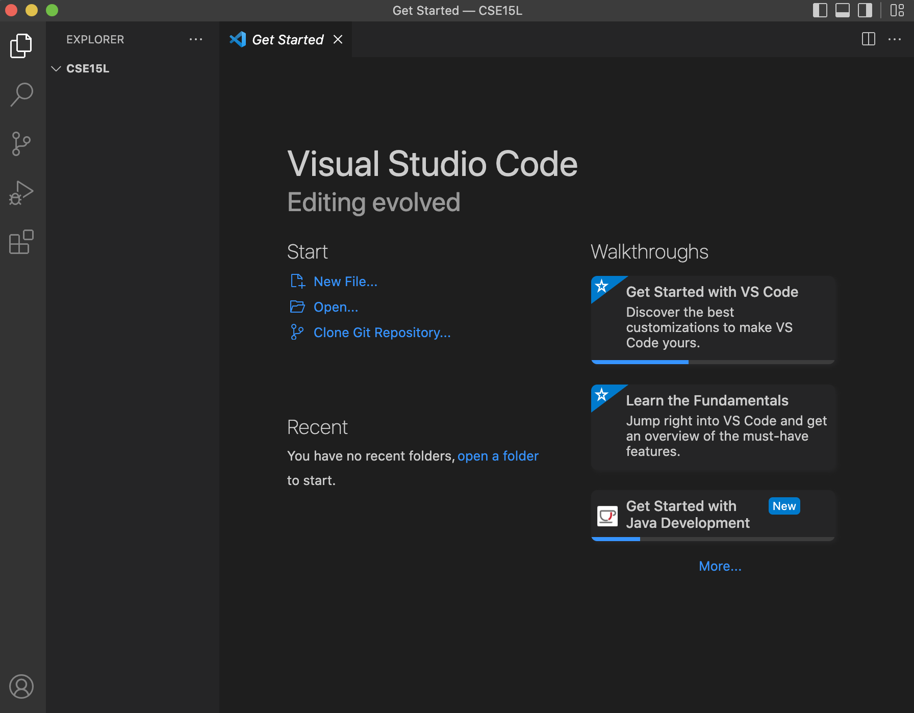
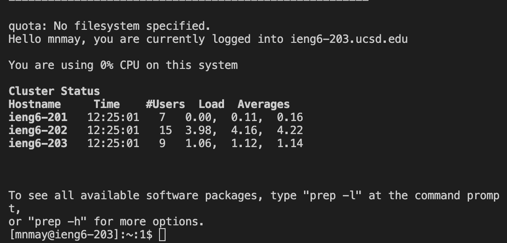
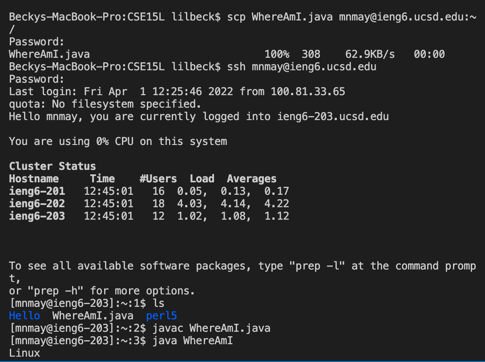
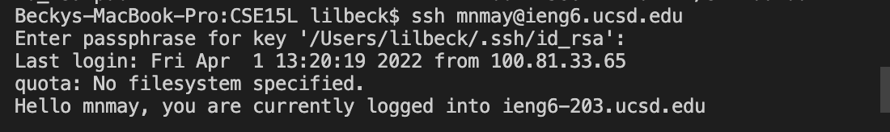
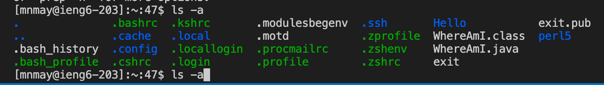

# ieng6 Tutorial

## Step 1:

Download VSCode onto your computer:
[Website to download](https://code.visualstudio.com/)

Once downloaded, open VSCode, it should look something like this:

## Step 2:

Open the terminal in VSCode (Ctrl + `, or use the Terminal → New Terminal menu option)

Type in the command below, but replace the zz with your course-specific account:

`$ ssh cs15lsp22zz@ieng6.ucsd.edu`

After this, you should get a message that says: 

`⤇ ssh cs15lsp22zz@ieng6.ucsd.edu`

`The authenticity of host 'ieng6.ucsd.edu (128.54.70.227)' can't be established.`

`RSA key fingerprint is SHA256:ksruYwhnYH+sySHnHAtLUHngrPEyZTDl/1x99wUQcec.`

`Are you sure you want to continue connecting (yes/no/[fingerprint])?`

You will want to say yes, and then enter your password. 

(*You won't be able to see the password being typed out, so it could be a good idea to copy and paste it from another page*)

It should look something like this:

## Step 3:

Now it is time to practice some basic commands in the terminal. Try running these commands on your computer and on the remote computer (after sshing like the step above shows) in different ways.

Here are some basic commands to try:

- ``cd ~``
- ``cd``
- ``ls -lat``
- ``ls -a``
- ``ls <directory>`` where ``<directory>`` is 
``/home/linux/ieng6/cs15lsp22/cs15lsp22abc``, where the ``abc`` is one of the other group members’ username
- ``pwd``
- ``mkdir``
- ``cp``
- ``cp /home/linux/ieng6/cs15lsp22/public/hello.txt ~/``
- ``cat /home/linux/ieng6/cs15lsp22/public/hello.txt``

(*an easy way to log out of the remote server in your terminal is using Ctrl-D or running the command ``exit``*)

Here is an example of what the ``ls`` command could look like on a remote server:

## Step 4:

Now you will learn how to copy a file from your computer to a remote computer. First, create a file called ``WhereAmI.java`` and put the following contents in it:

``class WhereAmI {``
  ``public static void main(String[] args) {``
  ``System.out.println(System.getProperty("os.name"));``
    ``System.out.println(System.getProperty("user.name"));``
    ``System.out.println(System.getProperty("user.home"));``
    ``System.out.println(System.getProperty("user.dir"));``

  ``}``

``}``

Then, run it using ``javac`` and ``java`` on your computer. Now try running the command below using your username in the correct spot:

``scp WhereAmI.java cs15lsp22zz@ieng6.ucsd.edu:~/``

You should have to type in your password, then try logging into the remote computer and using the ``ls`` command.

You should see the file in the home directory:

## Step 5:

Now we are going to learn a cool trick that can save a lot of time during the process of sshing into the remote computer. We are going to learn how to skip the step where you put in your password for the remote computer.

Here is what you need to run in your terminal:

``# on client (your computer)``

``$ ssh-keygen``

``Generating public/private rsa key pair.``

``Enter file in which to save the key (/Users/<user-name>/.ssh/id_rsa): /Users/<user-name>/.ssh/id_rsa``

``Enter passphrase (empty for no passphrase):``

At this point you want to make sure you just press enter, do not add a passphrase.

``Enter same passphrase again:``

Once this runs, you should then run these commands with your corresponding information:

``$ ssh cs15lsp22zz@ieng6.ucsd.edu``

``<Enter Password>``

``# now on server``

``$ mkdir .ssh``

``$ <logout>``

``# back on client``

`` $ scp /Users/<user-name>/.ssh/id_rsa.pub cs15lsp22zz@ieng6.ucsd.edu:~/.ssh/authorized_keys``

``# You use your username and the path you saw in the command above``

Now you should be able to login without putting in your password:

## Step 6

The last step is optimizing remote running. Try testing some things out that could make your coding more time efficient, then try to make a local edit to ``WhereAmI.java`` and copy and run it to the remote server.

Here are some helpful tips:

- ``$ ssh cs15lsp22zz@ieng6.ucsd.edu "ls"``  using the quotes at the end allows you to do both actions in one, so this will log you in and list the home directory on the remote server.
- ``$ cp WhereAmI.java OtherMain.java; javac OtherMain.java; java WhereAmI`` semicolons allow you to run multiple commands at once.
- You can also use the up-arrow on your keyboard to recall the last command that was run

Here is an example of an up arrow showing the same command as before:

That is the end of the tutorial!

## Thank you :)