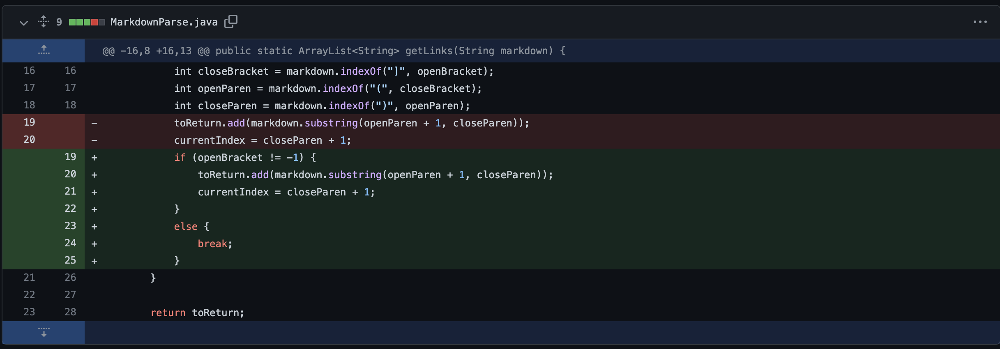
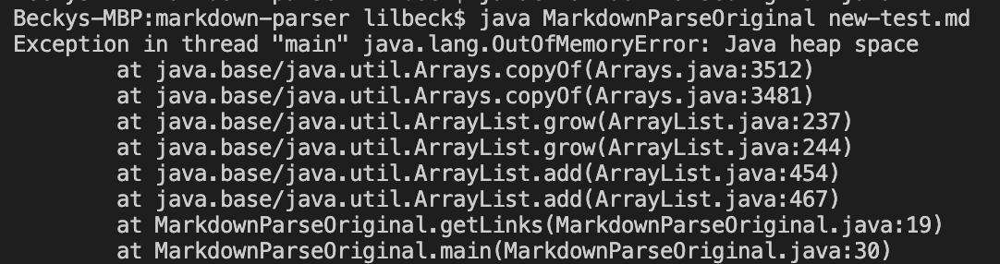
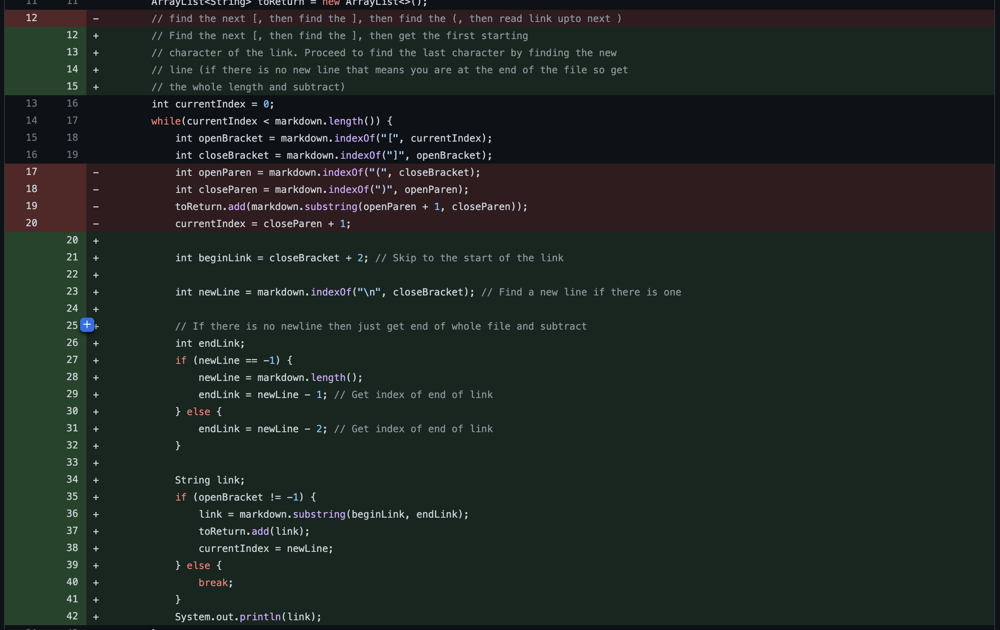
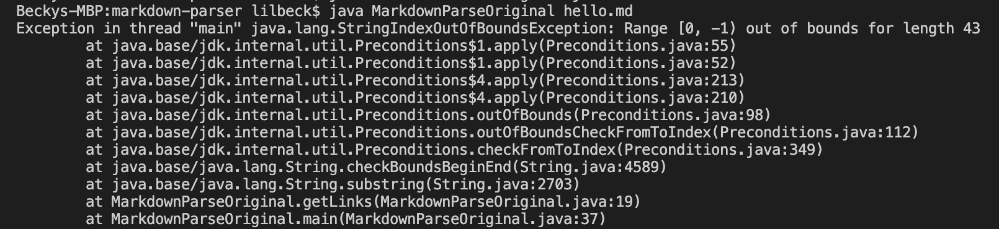

# Lab Report 2

## Code Change 1: Empty last line error

\

[Link to test file](https://github.com/willersss/markdown-parser/blob/main/new-test.md)

Symptom of failur-inducing input: \
"Exception in thread "main" java.lang.OutOfMemoryError"

Once the original code reads the last link, it tries to look for the next open parenthesis after that. Since the next line is empty, the output gives an out of memory error, not knowing where to end the loop. Adding the if statement to cause the loop to break if there are no more links fixed the problem.

\newln

## Code Change 2 and 3: Fixing multiple errors in one try (adding parenthesis in the middle of a link, and making the link surrounded by brackets instead of parenthesis)

\

[Link to test file 1](https://github.com/mnmay2020/markdown-parser/blob/main/hello.md)

Symptom of failur-inducing input for file 1: \
"Exception in thread "main" java.lang.StringIndexOutOfBoundsException: Range [0, -1) out of bounds for length 43"

[Link to test file 2](https://github.com/mnmay2020/markdown-parser/blob/main/new-test.md)

Symptom of failur-inducing input for file 2: \
This file ran, but produced the wrong output: 

For file 1, the error is prompted because there are no parenthesis for the file to be in, so it gives an out of bounds error. For file 2, the output is wrong because the parenthesis within the link make the code restart the loop again in the middle of the link. We had to create a code that would bypass the parenthesis and brackets so that it would only grab the link inside. Because we had two similar errors, we decided to trial and error these two problems at once, knowing that if we tried to focus only on one, we would end up having to redo the whole loop anyways.