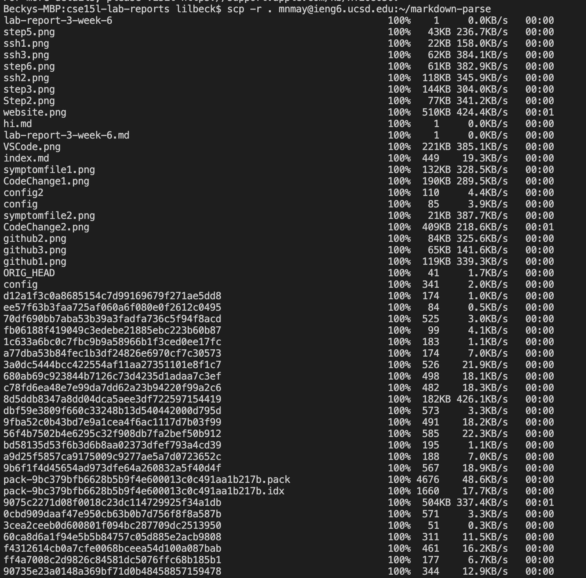

# Lab Report 3

## Streamlining ssh Configuration

1) .ssh/config file:

2) log in:

3) scp command:

## Setup Github Access from ieng6

1) public & private keys:

2) git action:

3) commit on github:

[Link for commit](https://github.com/mnmay2020/cse15l-lab-reports/commit/7a29787283c8a6310fedac8e8d1cd4011c0184b8)

## Copy whole directories with `scp -r`

1) copying markdown-parse:

2) ieng6:

3) running in one line:

