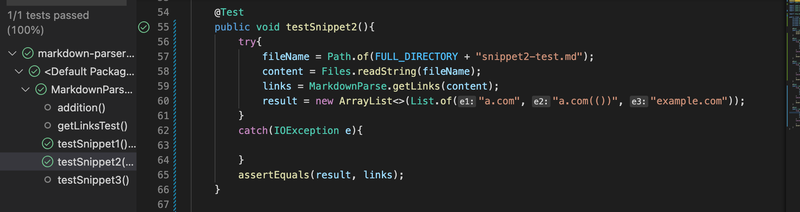

# Lab Report 4

[Link to personal Markdown-Parse repo](https://github.com/mnmay2020/markdown-parser)

[Link to reviewed Markdown-Parse repo](https://github.com/bchoUCSD/markdown-parser)

## Snippet 1:

The output for snippet 1, according to the CommonMark demo site, should look something like this in markdown:

With this in mind, the output for the MarkdownParse test should be ["google.com"]

For my implementation the code for the test and the test results are shown below

As you can see by the green check mark, the test has passed for snippet 1.

For the reviewed implementation the code for the test is the same, and the test results are shown below

As you can see by the green check mark, the test has passed for snippet 1.

# Snippet 2

The output for snippet 2, according to the CommonMark demo site, should look something like this in markdown:

With this in mind, the output for the MarkdownParse test should be ["a.com", "a.com(())", "example.com"]

For my implementation the code for the test and the test results are shown below

As you can see by the green check mark, the test has passed for snippet 2.

For the reviewed implementation the code for the test is the same, and the test results are shown below

As you can see by the green check mark, the test has passed for snippet 2.

# Snippet 3

The output for snippet 3, according to the CommonMark demo site, should look something like this in markdown:

With this in mind, the output for the MarkdownParse test should be ["https://sites.google.com/eng.ucsd.edu/cse-15l-spring-2022/schedule"]

For my implementation the code for the test and the test results are shown below

As you can see by the green check mark, the test has passed for snippet 3.

For the reviewed implementation the code for the test is the same, and the test results are shown below

As you can see by the green check mark, the test has passed for snippet 3.

# Questions

1) The code changes that allowed this test to pass were the ones from lines 35 to 41, where we redefined what a link should be, instead of just making it within the parenthesis, so it still printed out the correct one.

2) We had a test case like this in our original markdown-parse, so a lot of our code was based off of this specific edge case. This is also seen in our code when we redefine where the link is, instead of basing it off of the parenthesis.

3) I was surprised to see this one work, because I do not remember working on this tyoe of edge case before, but I believe it is similar to the above two questions on how we defined a link and also how we defined a new line by using "/n", so if the link just continues on, I think it just carries over and continues to enter it into the arrayList.

