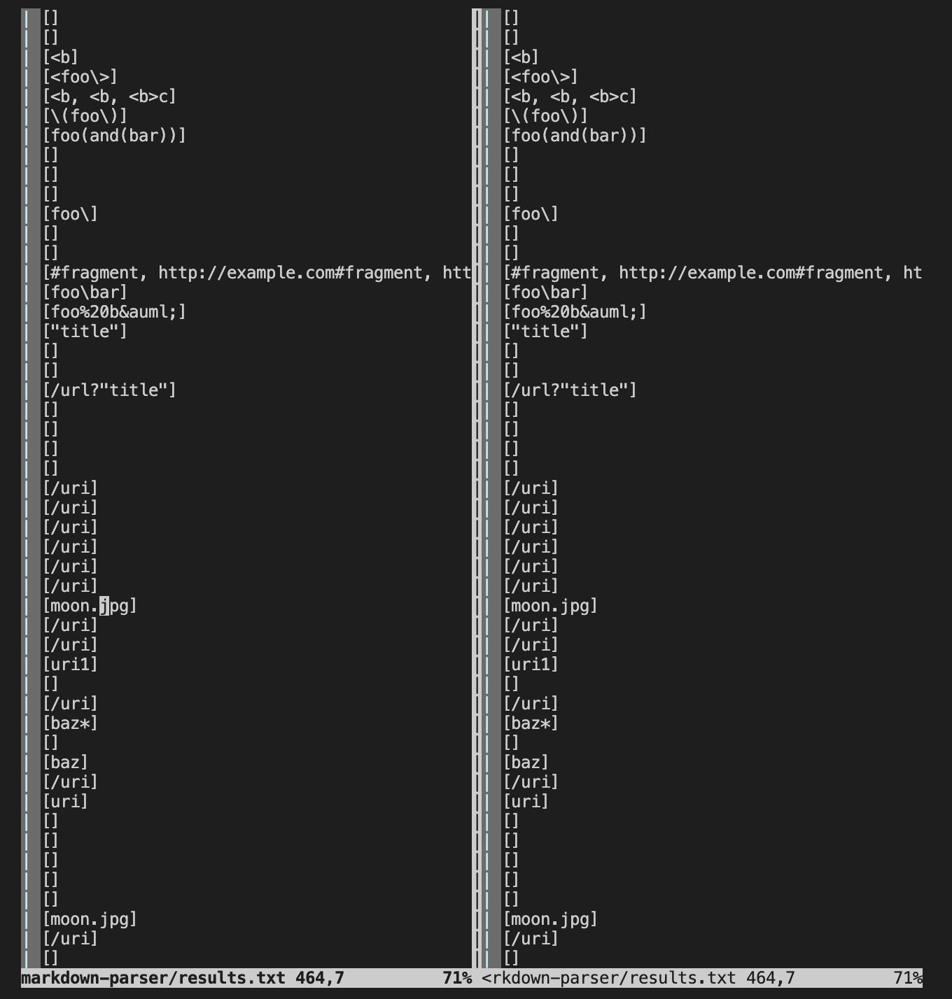
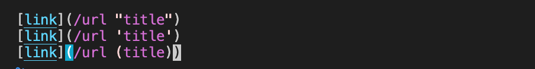
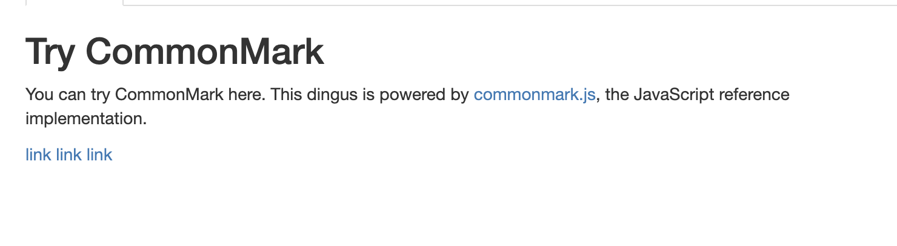
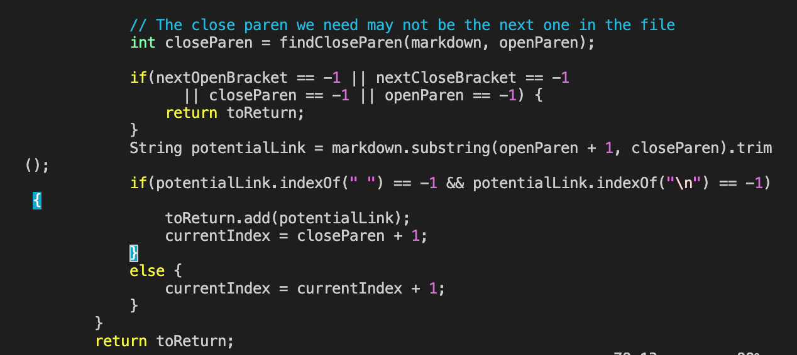
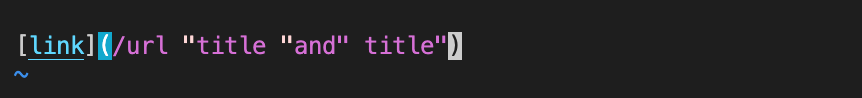
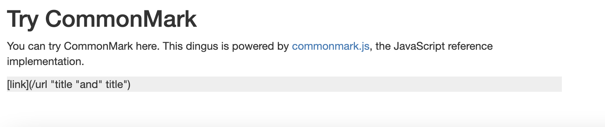
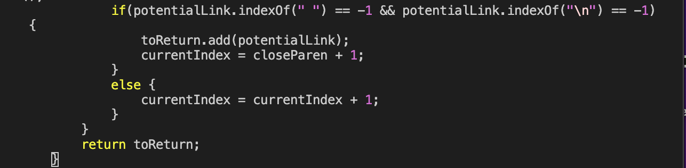

# Lab Report 5

## Using Vimdiff:

When using vimdiff, and searching manually, I was unable to find any differences between the cloned markdown parse and my own markdown parse results. So, I will instead just choose two tests and answer the questions below. Here is a screenshot of some of my vimdiff results:

## Test 1:

test file: 504.md
This test file looks like this:

The output, according to CommonMark, should look like this:

When ran, the output for both my code and the clone looks like this:

Both of these outputs as you can see are incorrect, because they should contain all of the links; [/url"title", /url'title', /url(title)]

The problem with the code is that the code is unable to read quotations and other characters within a link. This has to do with the section of the code of where the link ends and should be fixed to allow these kinds of inputs. Specifically, the code provided below:

## Test 2:

test file: 507.md
This test file looks like this:

The output, according to CommonMark, should look like this:

When ran, the output for both my code and the clone looks like this:

Both of these outputs as you can see are incorrect, because they should be an empty array; []

The problem with the code is that it does not end when the closing parenthesis ends, so it makes a link out of something before it gets to the end of the line. Otherwise, it would have been invalid, so the code to fix is the part of the code on where the link actually ends. Specifically the code provided below:

